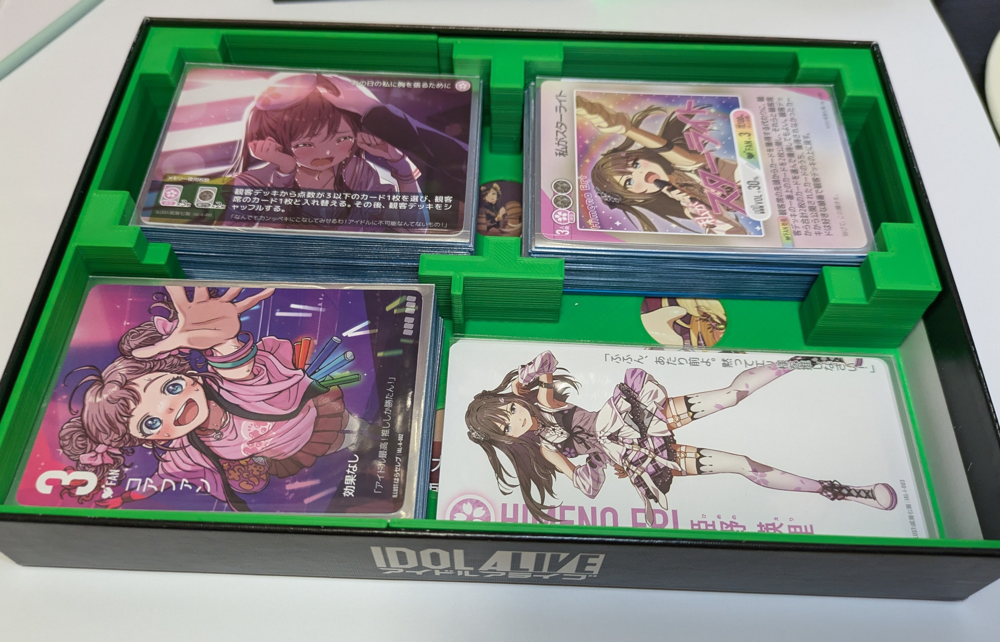

# idolalive_3dcase

　アイドルアライブのサプライ収納に使える3Dケースです。いくつか種類があるので、適当に印刷して使ってください。なお、3Dモデルは.f3dファイルと.stlファイルが用意してあるので、自分で修正して使うことも可能です。
## モデルについて
　いくつか種類があります。自分にあったものを選択してください。
### originalとsplitの違い
#### original
　もともとの3Dモデルです。印刷可能ならこちらを印刷してください。3Dプリントサービスを利用する場合はこのサイズが印刷可能だと思われます。
#### split
　originalを2つに分割した3Dモデルです。家庭用3Dプリンタを利用する場合は、originalサイズだと印刷不可能な場合が多いと思われるので、こちらを印刷してください。.stlファイルもleft,rightと分割してあるので、これらをどちらも印刷してください。 
　なお、ジョイントの部分がそれなりにシビアな寸法になっており、印刷精度によってハマらない場合があります。その場合は適当に削ってください。
### looseとtightの違い
　スリーブのサイズによって選択可能です。
#### loose
　カード収納場所は71mm*96mmです。カードを大きめのスリーブに入れている場合はこちらを選択してください。
#### tight
　カード収納場所は67mm*91mmです。カードを小さめのスリーブに入れている場合や生カードの場合はこちらを選択してください。
## 印刷方法
　3Dプリンタを持っている人は、サイズが十分であれば自宅の3Dプリンタで印刷可能だと思います。
 
　3Dプリンタを持っていない人は、インターネット上の3Dプリントサービスを利用することができます。3Dプリントサービスは色々存在しますが、JLCPCBが安いので私はよく使っています。以下のリンクから新規登録することでクーポンをもらうこともできます。
 
https://jlcpcb.com/JPV

## 要望
　要望がある場合、Issuesに投稿してもらえれば、そこそこの確率で対応すると思います。
